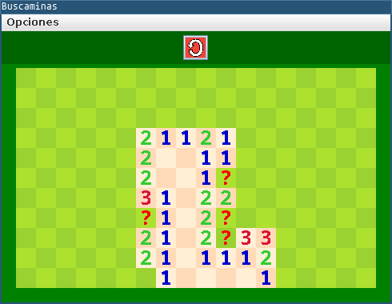
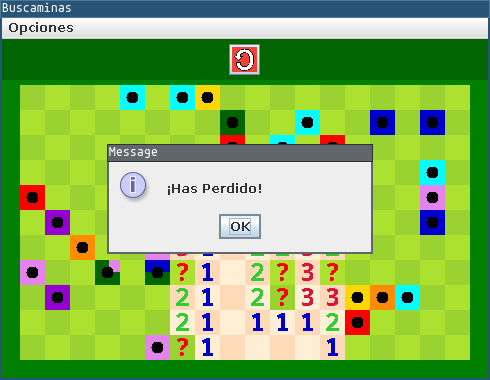

# buscaminas

La mayor parte de este juego fue desarrollado en un celular usando Termux, OpenJDK 17, Maven y VIM, las pruebas se hicieron usando el entorno de escritorio Xfce junto a VNC Server y la aplicación VNC Client en Android.

Video de muestra: [https://youtu.be/a6owHZ8yDzU](https://youtu.be/a6owHZ8yDzU)

Luego use Gradle para probar esta herramienta.

